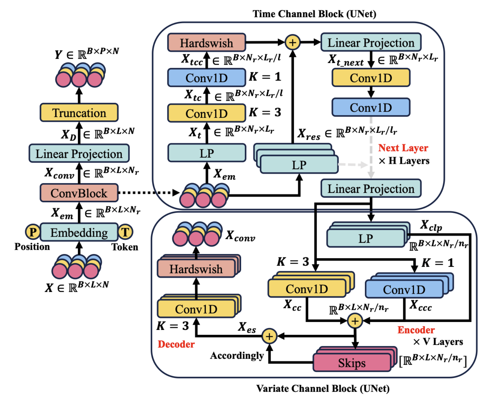

# 🐝 GluConv: Convincing Convolutions Meet Trustworthy Glucose Monitor for Continuous Diabetes Management

🙋 Sijie Xiong, Tao Sun, Haiqiao Liu, Cheng Tang, Yinlong Hu, Atsushi Shimada

🏫 Kyushu University, Hohai University

# 🥛 Takeaway

All detailed responses are contained in [GluConv Response Letter](./GluConv_Response_Letter.pdf).

The planed resubmission version is [GluConv Resubmission](./GluConv_Resubmission.pdf).

The confirmation of the outlier of XGBoost is contained in [outlier of XGBoost](./outlier_xgboost_weinstock.txt). The average time can be found by `Ctrl+F: Average Training Time`in this file.

🙏 Hope GluConv can be offered a chance to see a wider range of readers.

## 🌟 GluConv: Convincing, Convolutional, Convenient

# 🏆 Contributions

**Efficient UNets:** We propose two efficient UNet algorithms based on convolutions for temporal dependencies and variate correlations: Time Channel Block and Variate Channel Block. The architecture optimizes the fusion of both global and local features at multi-scales.

**GluConv \& Performance Superiority** Based on previous blocks, we propose GluConv and extensive experiments demonstrate that GluConv has superiority over benchmarks. GluConv is deemed as a **Conv**incing, **Conv**olutional, and **Conv**enient  model in terms of accuracy, trustworthiness, responsiveness, robustness.

# 🌞 Follow Me and Find Yourselves

## 🔧 Step 1: Environment

`activate conda python=3.10`

`pip install [according Pytorch]`

`pip install -r requirements`

## 📊 Step 2: Datasets

Unzip raw_data.zip to obtain all datasets.

# 🚀 Step 3: Implementation

Enter run.md to implement GluConv
